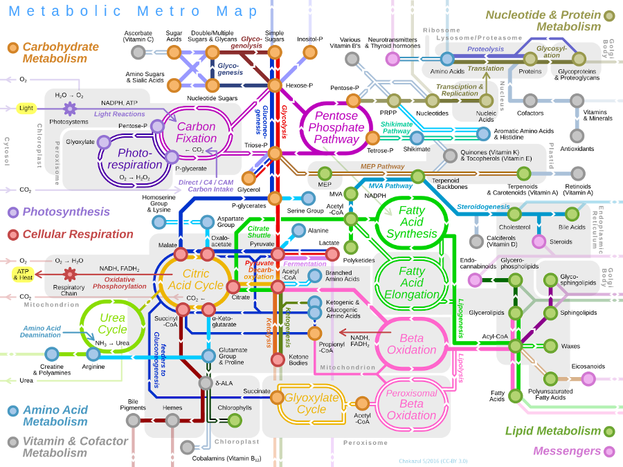

<!--  -->

<!-- _The above picture is exported from_ [Wikipedia](https://en.wikipedia.org/wiki/Metabolic_pathway). -->

## Basic Description

We present mlLGPR (**m**ulti-**l**abel **L**ogistic Re**G**ression for **P**athway P**R**ediction) is a software package that uses supervised multi-label classification and rich pathway features to infer metabolic networks at the individual, population and community levels of organization. mlLGPR's performance was evaluated using a corpora of 12 experimental datasets manifesting diverse multi-label properties, including manually curated organismal genomes, synthetic microbial communities and low complexity microbial communities. Resulting performance metrics equaled or exceeded previous reports for organismal genomes and identify specific challenges associated with features engineering and training data for community-level metabolic inference.

## Dependencies
We highly recommend installing [Anaconda](https://www.anaconda.com/) which is an open source distribution of the Python and R programming languages for data wrangling, predictive analytics, and scientific computing. The codebase is tested to work under Python 3.5. To install the necessary requirements, run the following commands:

``pip install -r requirements.txt``

Basically, *mlLGPR* requires following packages:
- [NumPy](http://www.numpy.org/) (>= 1.15)
- [scikit-learn](https://scikit-learn.org/stable/) (>= 0.20)
- [pandas](http://pandas.pydata.org/) (>= 0.23)
- [NetworkX](https://networkx.github.io/) (>= 2.2)
- [scipy](https://www.scipy.org/index.html) (==1.2)
- [fuzzywuzzy](https://pypi.org/project/fuzzywuzzy/)(==0.18)

## Experimental Objects and Test Samples
Please download the following files from [Zenodo](https://zenodo.org/deposit/3821137). 
- The link contains the following preprocessed files:
    - "object.pkl": an object containing the preprocessed MetaCyc database.
    - "pathway_ec.pkl": a matrix representing Pathway-EC association of size 3650 x 2526.
    - "pathway2ec_idx.pkl": the pathway2ec association indices.                        
- We also provided pretrained models and samples for testing:
    - "gold_dataset_ptw_ec_63_X.pkl": Golden dataset of size 63 x 3650. First six examples correspond to: AraCyc, EcoCyc, HumanCyc, LeishCyc, TrypanoCyc, and YeastCyc.
    - "gold_dataset_ptw_ec_63_y.pkl": Golden dataset of size 63 x 2526. First six examples correspond pathways to: AraCyc, EcoCyc, HumanCyc, LeishCyc, TrypanoCyc, and YeastCyc.
    - "gold_dataset_ptw_ec_63_minpath_data.txt": Golden dataset of size 63 x 2526. First six examples correspond pathways to: AraCyc, EcoCyc, HumanCyc, LeishCyc, TrypanoCyc, and YeastCyc.
    - "gold_dataset_ptw_ec_63_minpath_mapping.txt": Golden dataset of size 63 x 2526. First six examples correspond pathways to: AraCyc, EcoCyc, HumanCyc, LeishCyc, TrypanoCyc, and YeastCyc.
    - "mg_symbionts_X.pkl": Symbiont dataset of size 3 x 3650.
    - "mg_cami_X.pkl": CAMI dataset of size 40 x 3650.
    - "mg_cami_y.pkl": CAMI dataset of size 40 x 2526.
    - "mg_hots_4_X.pkl": HOT metagenomics dataset of size 6 x 3650.
    - "syn_dataset_ptw_ec_15000_X.pkl": Synset-2 dataset of size 15000 x 3650.
    - "syn_dataset_ptw_ec_15000_y.pkl": BioCyc (v20.5 tier 2 \& 3) dataset of size 15000 x 2526.
    - "mlLGPR_en_ab_re_pe.pkl": a pretrained model using "syn_dataset_ptw_ec_15000_X.pkl" and "syn_dataset_ptw_ec_15000_y.pkl".

## Installation and Basic Usage
Run the following commands to clone the repository to an appropriate location:

``git clone https://github.com/hallamlab/mlLGPR.git``

For all experiments, navigate to ``src`` folder then run the commands of your choice. For example, to display *mlLGPR*'s running options use: `python main.py --help`. It should be self-contained. 

### Preprocessing

To preprocess data, we provide few examples.

#### Example 1
To preprocess datasets with **no noise** to the pathway2ec association matrix ("pathway2ec.pkl"), execute the following command:

``python main.py --preprocess-dataset --ssample-input-size 1 --object-name "biocyc.pkl" --pathway2ec-name "pathway2ec.pkl" --pathway2ec-pidx-name "pathway2ec_idx.pkl" --features-name "path2vec_cmt_tf_embeddings.npz" --hin-name "hin_cmt.pkl" --mdpath [Location of the features] --ospath [Location to all objects except features]``

#### Example 2
To preprocess datasets with **20% noise** to the pathway2ec association matrix ("pathway2ec.pkl"), execute the following command:

``python main.py --preprocess-dataset --ssample-input-size 0.2 --object-name "biocyc.pkl" --pathway2ec-name "pathway2ec.pkl" --pathway2ec-pidx-name "pathway2ec_idx.pkl" --features-name "path2vec_cmt_tf_embeddings.npz" --hin-name "hin_cmt.pkl" --mdpath [Location of the features] --ospath [Location to all objects except features]``

#### Example 3
To preprocess datasets with **20% noise** to the pathway2ec association (*pathway2ec.pkl*), the pathway to pathway association (*A*), and the EC to EC association (*B*) matrices, execute the following command:

``python main.py --preprocess-dataset --white-links --ssample-input-size 0.2 --object-name "biocyc.pkl" --pathway2ec-name "pathway2ec.pkl" --pathway2ec-pidx-name "pathway2ec_idx.pkl" --features-name "path2vec_cmt_tf_embeddings.npz" --hin-name "hin_cmt.pkl" --mdpath [Location of the features] --ospath [Location to all objects except features]``


### Train
All the command arguments are initiated through [main.py](main.py) file. 
- You need to obtain [MetaCyc](https://metacyc.org/) database in order to extract information. Please modify the content of ``Path.py`` inside utility folder as necessary.
- In addition, please download six database: AraCyc, EcoCyc, HumanCyc, LeishCyc, TrypanoCyc, and YeastCyc from [biocyc](https://biocyc.org/).


#### Example
To extract information from [MetaCyc](https://metacyc.org/), create golden and synthetic samples, train mlLGPR using elastic-net, evaluate, and predict on dataset, simply set the arguments in the [main.py](main.py) file as:

```python main.py --biocyc --train --evaluate --predict --build_syn_dataset --nSample 15000 --average_item_per_sample 500 --build_synthetic_features --build_golden_dataset --build_golden_features --extract_info_mg --build_mg_features --ds_type "syn_ds" --trained_model "mlLGPR_en_ab_re_pe.pkl" --kbpath "[MetaCyc location]" --dspath "[Location to the processed dataset]" --mdpath "[Location to store or save the model]" --rspath "[Resuls location]" --ospath "[Object location]" --n_jobs 10 --nEpochs 10 --nBatches 5```

where 
- Object location: The location to the data object that contains extracted information from the MetaCyc database and all the datbases.


## Citing
If you find *mlLGPR* useful in your research, please consider citing the following paper:
- M. A. Basher, Abdur Rahman, McLaughlin, Ryan J., and Hallam, Steven J.. **["Metabolic pathway inference using multi-label classification with rich pathway features."](https://doi.org/10.1101/2020.02.02.919944)**, bioRxiv (2020).

## Contact
For any inquiries, please contact: [arbasher@alumni.ubc.ca](mailto:arbasher@alumni.ubc.ca)

## Upcoming features
- Incorporate graph based learning.
