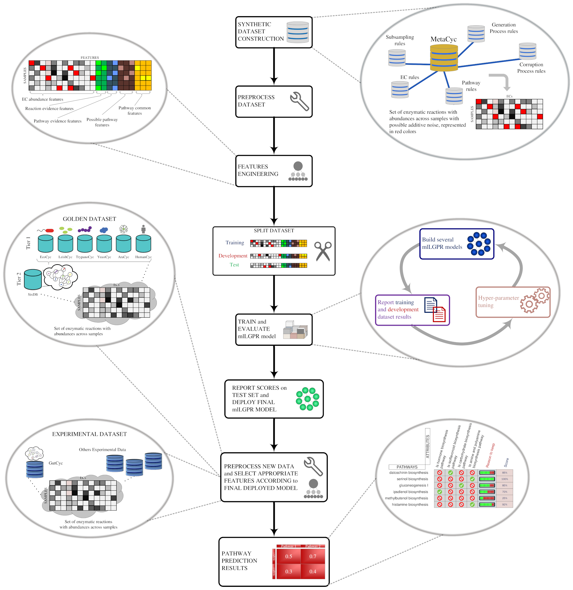

## Basic Description

We present a software package called mlLGPR (**m**ulti-**l**abel **L**ogistic re**G**ression for **P**athway p**R**ediction) that uses supervised multi-label classification and rich pathway features to infer metabolic networks at the individual, population and community levels of organization. mlLGPR's performance was evaluated using a corpora of 12 experimental datasets manifesting diverse multi-label properties, including manually curated organismal genomes, synthetic microbial communities and low complexity microbial communities. Resulting performance metrics equaled or exceeded previous reports for organismal genomes and identify specific challenges associated with features engineering and training data for community-level metabolic inference.

## Dependencies
We highly recommend installing [Anaconda](https://www.anaconda.com/) which is an open source distribution of the Python and R programming languages for data wrangling, predictive analytics, and scientific computing. The codebase is tested to work under Python 3.5. To install the necessary requirements, run the following commands:

``pip install -r requirements.txt``

Basically, *mlLGPR* requires following packages:
- [NumPy](http://www.numpy.org/) (>= 1.15)
- [scikit-learn](https://scikit-learn.org/stable/) (>= 0.20)
- [pandas](http://pandas.pydata.org/) (>= 0.23)
- [NetworkX](https://networkx.github.io/) (>= 2.2)
- [scipy](https://www.scipy.org/index.html) (==1.2)
- [fuzzywuzzy](https://pypi.org/project/fuzzywuzzy/) (==0.18)

## Experimental Objects and Test Samples
Please download the following files from [Zenodo](https://zenodo.org/record/3821137#.XtdZ4zdKjeQ). 
- The link contains the following preprocessed files:
    - "object.pkl": an object containing the preprocessed seven databases (MetaCyc, AraCyc, EcoCyc, HumanCyc, LeishCyc, TrypanoCyc, and YeastCyc).
    - "pathway_ec.pkl": an object containing Pathway-EC associations.
    - "reaction_ec.pkl": an object containing Reaction-EC associations.
    - "ec2pathway.txt": a text file containing Pathway to EC associations.
    - "pathwayfeature.pkl": a matrix representing features of pathways of size (2526, 34).
    - "ecfeature.pkl": a matrix representing features of ECs of size (6378, 25).
- We also provided pretrained models and samples for testing:
    - "gold_dataset_ptw_ec_63_X.pkl": The golden dataset of size (63, 89602). First six examples correspond to: AraCyc, EcoCyc, HumanCyc, LeishCyc, TrypanoCyc, and YeastCyc.
    - "gold_dataset_ptw_ec_63_y.pkl": The golden dataset of size (63, 2526). First six examples correspond pathways to: AraCyc, EcoCyc, HumanCyc, LeishCyc, TrypanoCyc, and YeastCyc.
    - "mg_symbionts_X.pkl": The symbiont dataset of size (3, 89602), corresponding moranella, tremblaya, and composite genomes, respectvely.
    - "symbiont.zip": The symbiont dataset in the PathoLogic input format (0.pf).
    - "mg_cami_X.pkl": The CAMI dataset of size (40, 89602).
    - "mg_hots_4_X.pkl": The HOT metagenomics dataset of size (13, 89602). The data is a combination of DNA and RNA. Samples for DNA: [5,6] for 25m;  [0,1] for 75m; [2] for 110m; and [3,4] for 500m. Samples for RNA: [7,8,9] for 25m;  [10] for 75m; [12] for 110m; and [11] for 500m.
    - "syn_dataset_ptw_ec_15000_X.pkl": The synset dataset (Synset-1) of size (15000, 89602).
    - "syn_dataset_ptw_ec_15000_y.pkl": Pathways of *syn_dataset_ptw_ec_15000_X.pkl* dataset of size (15000, 2526).
    - "syn_dataset_ptw_ec_15000_X_noise.pkl": The noisy synset dataset (Synset-2) of size (15000, 89602).
    - "syn_dataset_ptw_ec_15000_y_noise.pkl": Pathways of *syn_dataset_ptw_ec_15000_X_noise.pkl* dataset of size (15000, 2526).
    - "synset_50_X.pkl": The synset dataset of size (50, 89602).
    - "synset_50_y.pkl": Pathways of *synset_50_X.pkl* dataset of size (50, 2526).
    - "mlLGPR_en_ab_re_pe.pkl": a pretrained model on "syn_dataset_ptw_ec_15000_X.pkl" and "syn_dataset_ptw_ec_15000_y.pkl". This model was trained using abundance, reaction evidence, and pathway evidence features.
- Please store the files in **one directory** for the best practice.
    
## Installation and Basic Usage
Run the following commands to clone the repository to an appropriate location:

``git clone https://github.com/hallamlab/mlLGPR.git``

For all experiments, navigate to ``src`` folder then run the commands of your choice. For example, to display *mlLGPR*'s running options use: `python main.py --help`. It should be self-contained. All the command arguments are initiated through [main.py](main.py) file. It is necessary to obtain [MetaCyc](https://metacyc.org/) database to extract information. In addition, please download six databases: AraCyc, EcoCyc, HumanCyc, LeishCyc, TrypanoCyc, and YeastCyc from [biocyc](https://biocyc.org/). However, we provided you the **object.pkl** that contains the necessary information for preprocessing, training, and prediction.

### Preprocessing
To preprocess data, we provided a few examples.

The description about arguments in the following examples are: *--load-object*: a true/false variable indicating whether to enable parsing PGDBs, *--build-syn-dataset*: a true/false variable suggesting whether to generate simulated data, *--add-noise*: a true/false variable indicating whether to add noise during synthetic samples curation, *--nSample*: an integer variable corresponding the number of samples to generate (e.g. 10), *--average-item-per-sample*: an integer variable corresponding the expected pathway size for each generated instance (e.g. 100), *--ncomponents-to-corrupt*: an integer variable corresponding the number of true ECs to be corrupted for each pathway (e.g. 2), *--lower-bound-nitem-ptw*: indicates to refrain corrupting pathways that have ECs less than this threshold (e.g. 1), *--ncomponents-to-corrupt-outside*: an integer variable corresponding the number of false ECs to be inserted during synthetic samples generation  (e.g. 2), *--objectname*: is the name of the file that contains all necessary information obtained from PGDBs (e.g. "object.pkl"), *--pathwayfeature*: is the file name that stores the properties of pathways (e.g. "pathwayfeature.pkl"), *--ecfeature*: is the file name that stores the properties of ECs (e.g. "ecfeature.pkl"), *--pathway-ec*: is the file name that stores pathway to EC mapping information (e.g. "pathway_ec.pkl"), *--ospath*: is the location to the directory containing various object files, *--dspath*: is the location to the dataset folder, and *--kbpath*: is the location to the folder containing the flat-files of PGDBs.

If PGDBs were not provided, then skip the example 1. The remaining examples can be executed using files provided in [Zenodo](https://zenodo.org/record/3821137#.XtdZ4zdKjeQ). 

#### Example 1
To preprocess PGDBs, execute the following command:

``python main.py --biocyc --load-object --objectname "object.pkl" --pathwayfeature "pathwayfeature.pkl" --ecfeature "ecfeature.pkl" --ospath "[path to object files]" --kbpath "[path to PGDBs (flat-files)]"``

Several files will be generated (object.pkl, pathwayfeature.pkl, ecfeature.pkl, pathway_ec.pkl, reaction_ec.pkl, and ec2pathway.txt), and stored in a location specified by the ospath argument.

**NOTE** you need to download PGDBs from [biocyc](https://biocyc.org/).

#### Example 2
In cases where you were not able to obtain PGDBs, you can still run all the below examples using files provided in [Zenodo](https://zenodo.org/record/3821137#.XtdZ4zdKjeQ). Please download the files. For example, if you want to generate noisy samples using **--build-syn-dataset** and **adding noise** arguments, execute the following command:

``python main.py --biocyc --build-syn-dataset --add-noise --nSample 10 --average-item-per-sample 100 --ncomponents-to-corrupt 2 --lower-bound-nitem-ptw 1 --ncomponents-to-corrupt-outside 2 --objectname "object.pkl" --pathway-ec "pathway_ec.pkl" --ecfeature "ecfeature.pkl" --ospath "[path to object files]" --dspath "[path to folder containing datasets]"``

This will generate several files located in dspath: synset_10_Xm.pkl that contains only ECs with abundance information, synset_10_X.pkl that contains ECs with their features, and synset_10_y.pkl that comprise of pathway labels.

#### Example 3
If you want to generate non-noisy samples, run the following command using **--build-syn-dataset** argument:

``python main.py --biocyc --build-syn-dataset --nSample 10 --average-item-per-sample 100 --ncomponents-to-corrupt 2 --lower-bound-nitem-ptw 1 --ncomponents-to-corrupt-outside 2 --objectname "object.pkl" --pathway-ec "pathway_ec.pkl" --ecfeature "ecfeature.pkl" --ospath "[path to object files]" --dspath "[path to folder containing datasets]"``

You should get the same files as in example 2.

#### Example 4
To construct golden samples, execute followings command using **--build-golden-dataset**:

``python main.py --biocyc --build-golden-dataset --objectname "object.pkl" --pathway-ec "pathway_ec.pkl" --ecfeature "ecfeature.pkl" --ospath "[path to object files]" --dspath "[path to folder containing datasets]"``

You should get the same files as in example 2 prefixed by "golden".

#### Example 5
You can execute the above examples while adding noise using the following command:

``python main.py --biocyc --load-object --build-golden-dataset --build-syn-dataset --add-noise --nSample 10 --average-item-per-sample 100 --ncomponents-to-corrupt 2 --lower-bound-nitem-ptw 1 --ncomponents-to-corrupt-outside 2 --objectname "object.pkl" --pathwayfeature "pathwayfeature.pkl" --ecfeature "ecfeature.pkl" --ospath "[path to object files]" --kbpath "[path to PGDBs (flat-files)]" --dspath "[path to folder containing datasets]"``

You should obtain the same results as in examples 1, 2, and 3.

or skip processing PGDBs:

``python main.py --biocyc --build-golden-dataset --build-syn-dataset --add-noise --nSample 10 --average-item-per-sample 100 --ncomponents-to-corrupt 2 --lower-bound-nitem-ptw 1 --ncomponents-to-corrupt-outside 2 --objectname "object.pkl" --pathwayfeature "pathwayfeature.pkl" --ecfeature "ecfeature.pkl" --ospath "[path to object files]" --dspath "[path to folder containing datasets]"``

You should obtain the same results as in examples 2 and 3.

### Training

To train data, we provided a few examples.

The description about arguments in the following examples are: *--load-prepared-dataset*: a true/false variable indicating whether to load datasets after applying stratified sampling approach, *--train-size*: a real number variable in [0.0, 1.0] indicating the training size, *--val-size*: a real number variable in [0.0, 1.0] indicating the validation size, *--binarize*: a true/false variable indicating whether to binarize data (set feature values to 0 or 1), *--penalty*: is the preferred choice of regularization (e.g. "elasticnet"), *--alpha*: is a real number variable indicating the amount of regularization to be applied (e.g. 0.0001), *--l2-ratio*: is a real number variable suggesting the elasticnet mixing parameter, with 0 <= l2_ratio <= 1 (e.g.  0.65), *--objectname*: is the name of the file that contains all necessary information obtained from PGDBs (e.g. "object.pkl"), *--X-name*: is the input file name (e.g. "synset_50_X.pkl"), *--y-name*: is the output file name (e.g. "synset_50_y.pkl"), *--file-name*: is the file name corresponding the training, validation, test datasets, *--usePossibleClassFeatures*: a true/false variable indicating whether to apply possible pathway features (PP) in training, *--useLabelComponentFeatures*: a true/false variable indicating whether to apply pathway to ec common mapping features (PC) in training, *--ospath*: is the location to the directory containing various object files, *--dspath*: is the location to the dataset folder, *--mdpath*: is the location to the folder containing the trained model, *--n-jobs*: an integer variable corresponding the number of CPU cores to be consumed for training or prediction (e.g. 1), *--nEpochs*: an integer variable corresponding the number of epochs to train mlLGPR (e.g. 3), and *--nBatches*: an integer variable corresponding the size of a single mini-batch for training/predicting mlLGPR (e.g. 1).
                        
The following examples can be executed using files provided in [Zenodo](https://zenodo.org/record/3821137#.XtdZ4zdKjeQ). 

#### Example 1
To train mlLGPR using elastic-net with **load-prepared-dataset** option, execute the following command:

``python main.py --train --load-prepared-dataset --train-size 0.9 --val-size 0.15 --binarize --penalty "elasticnet" --alpha 0.0001 --l2-ratio 0.65 --objectname "object.pkl" --X-name "synset_50_X.pkl" --y-name "synset_50_y.pkl" --file-name "synset" --ospath "[path to folder containing object files]" --dspath "[path to folder containing datasets]" --mdpath "[path to folder containing model]" --n-jobs 1 --nEpochs 3 --nBatches 1``

This will result in multiple training, validation, test data located in dspath, and a model "mlLGPR_en_ab_re_pe.pkl" stored in mdpath.

#### Example 2
If a dataset was previously partitioned, execute the following command for training: 

``python main.py --train --binarize --penalty "elasticnet" --alpha 0.0001 --l2-ratio 0.65 --objectname "object.pkl" --file-name "synset" --ospath "[path to folder containing object files]" --dspath "[path to folder containing datasets]" --mdpath "[path to folder containing model]" --n-jobs 1 --nEpochs 3 --nBatches 1``

This will result in a model "mlLGPR_en_ab_re_pe.pkl" stored in mdpath.

#### Example 3
To enable training using L2 regularization, run the following command: 

``python main.py --train --binarize --penalty "l2" --alpha 0.0001 --l2-ratio 0.65 --objectname "object.pkl" --X-name "synset_50_X.pkl" --y-name "synset_50_y.pkl" --file-name "synset" --ospath "[path to folder containing object files]" --dspath "[path to folder containing datasets]" --mdpath "[path to folder containing model]" --n-jobs 1 --nEpochs 3 --nBatches 1``

This will result in a model "mlLGPR_en_ab_re_pe.pkl" stored in mdpath. You can change --penalty "l2" to --penalty "l1" for L1 regularization.

#### Example 4
To training using possible pathway and pathway common features, run the following command: 

``python main.py --train --usePossibleClassFeatures --useLabelComponentFeatures --binarize --penalty "elasticnet" --alpha 0.0001 --l2-ratio 0.65 --objectname "object.pkl" --X-name "synset_50_X.pkl" --y-name "synset_50_y.pkl" --file-name "synset" --ospath "[path to folder containing object files]" --dspath "[path to folder containing datasets]" --mdpath "[path to folder containing model]" --n-jobs 1 --nEpochs 3 --nBatches 1``

This will result in a model "mlLGPR_en_ab_re_pe_pp_pc.pkl" stored in mdpath.

### Predicting

To infer pathways, we provided a few examples.

The description about arguments in the following examples are: *--predict*: a true/false variable indicating whether to predict sets of pathways, *--parse-input*: a true/false variable indicating whether to parse files from input in 0.pf format, *--model*: the name of the pretrained mlLGPR model (e.g. "mlLGPR_en_ab_re_pe.pkl"), *--use-tCriterion*: a true/false variable indicating whether to employ adaptive beta prediction strategy, *--adaptive-beta*: is a real number in (0,1) corresponding the adaptive beta paramter (e.g. 0.45), *--X-name*: is the input file name (e.g. "synset_parse.pkl"), *--file-name*: the name of parsed input file in a matrix format (e.g. "synset_parse"), *--predict-file*: is the name of the file to store the predicted pathways (e.g. "mlLGPR"), *--objectname*: is the name of the file that contains all necessary information obtained from PGDBs (e.g. "object.pkl"), *--ecfeature*: is the file name that stores the properties of ECs (e.g. "ecfeature.pkl"), *--pathway-ec*: is the file name that stores pathway to EC mapping information (e.g. "pathway_ec.pkl"), *--ospath*: is the location to the directory containing various object files, *--dspath*: is the location to the dataset folder, *--mdpath*: is the location to the folder containing the trained model, *--rspath*: is the location to the folder to store prediction results, *--n-jobs*: an integer variable corresponding the number of CPU cores to be consumed for training or prediction (e.g. 1), and *--nBatches*: an integer variable corresponding the size of a single mini-batch for training/predicting mlLGPR (e.g. 1).
                        
The following examples can be executed using files provied in [Zenodo](https://zenodo.org/record/3821137#.XtdZ4zdKjeQ). 

#### Example 1

mlLGPR takes PathoLogic input format (0.pf) for inference. We provided a sample (symbiont.zip). Please unzip and save it into dspath. Next, run the following command:

``python main.py --predict --parse-input --model "mlLGPR_en_ab_re_pe.pkl" --file-name "synset_parse" --objectname "object.pkl" --pathway-ec "pathway_ec.pkl" --ecfeature "ecfeature.pkl" --predict-file "mlLGPR" --ospath "[path to folder containing object files]" --dspath "[path to folder containing datasets]/symbiont" --mdpath "[path to folder containing model]" --rspath "[path to folder containing prediction outputs]" --n-jobs 1 --nBatches 1``

This would create two files, "mlLGPR_en_ab_re_pe.lists" and "mlLGPR_en_ab_re_pe.details", corresponding a list of infered pathways and predicted pathways with score and abundance information. Scores are in [0,1] where higher value entails strong confidence. 

#### Example 2

Alternatively, you can run the following command if you already parsed files (e.g. "mg_cami_X.pkl"):

``python main.py --predict --X-name "mg_cami_X.pkl" --model "mlLGPR_en_ab_re_pe.pkl" --objectname "object.pkl" --predict-file "mlLGPR" --ospath "[path to folder containing object files]" --dspath "[path to folder containing datasets]" --mdpath "[path to folder containing model]" --rspath "[path to folder containing prediction outputs]" --n-jobs 1 --nBatches 1``

The output files should have the same name as in example 1.

#### Example 3

For the adaptive prediction, run the following command for "mg_cami_X.pkl" file using **--use-tCriterion** and **--adaptive-beta** arguments:

``python main.py --predict --use-tCriterion --adaptive-beta 0.45 --X-name "mg_cami_X.pkl" --model "mlLGPR_en_ab_re_pe.pkl" --objectname "object.pkl" --predict-file "mlLGPR" --ospath "[path to folder containing object files]" --dspath "[path to folder containing datasets]" --mdpath "[path to folder containing model]" --rspath "[path to folder containing prediction outputs]" --n-jobs 1 --nBatches 1``

The output files should have the same name as in example 1.

## Citing
If you find *mlLGPR* useful in your research, please consider citing the following paper:
- M. A. Basher, Abdur Rahman, McLaughlin, Ryan J., and Hallam, Steven J.. **["Metabolic pathway inference using multi-label classification with rich pathway features."](https://doi.org/10.1371/journal.pcbi.1008174)**, PLoS Comput Biol (2020).

## Contact
For any inquiries, please contact: [arbasher@alumni.ubc.ca](mailto:arbasher@alumni.ubc.ca)
